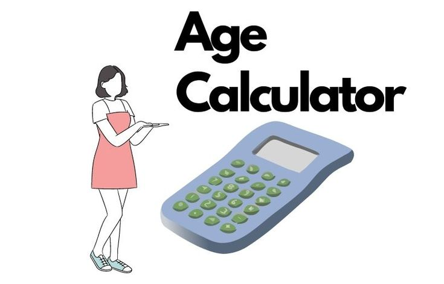
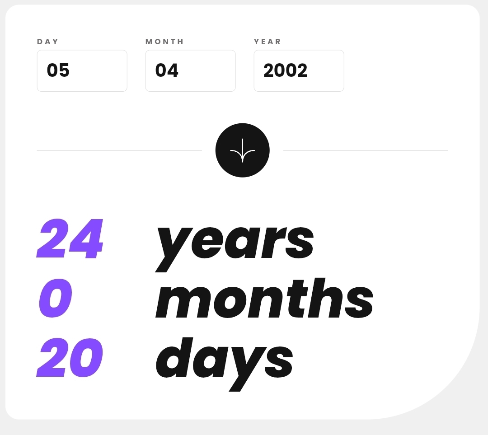

<h1 align="center">✦ Calculateur d'Âge ✦</h1>
<h3 align="center">L'Application Qui Révèle Votre Âge Exact — Années, Mois, Jours</h3>

  <em>Une précision chirurgicale. Un design époustouflant. Le tout en pur JavaScript, sans librairie.</em>

  
  
  
  
  
  
  
    
  
  

---

## 📖 **Table des Matières**

- [🌟 Présentation Générale](#-présentation-générale)
- [✨ Fonctionnalités Principales](#-fonctionnalités-principales)
- [🎯 Pourquoi Cette Application Est Différente](#-pourquoi-cette-application-est-différente)
- [🚀 Démonstration en Direct](#-démonstration-en-direct)
- [🧩 Anatomie du Projet](#-anatomie-du-projet)

---

## 🌟 **Présentation Générale**

Le **Calculateur d'Âge** est bien plus qu'un simple outil de calcul. C'est une **expérience utilisateur raffinée**, conçue pour offrir une réponse instantanée, précise et visuellement satisfaisante à une question universelle : *"Quel est mon âge exact ?"*.

Contrairement à d'autres calculateurs qui se contentent des années, celui-ci décompose votre âge en **années, mois et jours**, en tenant compte des **années bissextiles**, des **mois de différentes longueurs** et des **transitions de fin de mois** avec une exactitude irréprochable.

L'application a été développée avec **trois technologies pures du web** — HTML5, CSS3 et JavaScript ES6+ — sans aucune dépendance externe. Chaque ligne de code a été pensée pour la performance, la maintenabilité et l'élégance.

---

## ✨ **Fonctionnalités Principales**

| **Catégorie**               | **Description Détaillée** |
|------------------------------|---------------------------|
| 🧮 **Calcul d'Âge Précis**  | Calcule les **années**, **mois** et **jours** exacts entre la date de naissance et aujourd'hui. Gère correctement les emprunts : si les jours sont négatifs, un mois est retiré ; si les mois sont négatifs, une année est retirée. Les années bissextiles sont automatiquement prises en compte via l'objet natif `Date`. |
| ✅ **Validation Intelligente** | Vérifie en temps réel : champs vides, plages valides (`1–31` pour le jour, `1–12` pour le mois), années futures impossibles, validité calendaire réelle (ex : 30 février rejeté). |
| 🎨 **Design Premium**       | Interface moderne inspirée du challenge officiel Frontend Mentor : carte blanche arrondie avec un coin inférieur droit en courbe large (200px), typographie Poppins en graisse 800 pour les résultats, palette contrastée et harmonieuse. |
| 🌀 **Animations Fluides**   | Les nombres s'animent de 0 à leur valeur finale avec une accélération progressive (courbe d'easing cubique *ease-out*) sur 900ms, offrant une sensation de vivacité et de qualité. |
| 📱 **Responsive Design**    | S'adapte parfaitement de 320px (petits smartphones) à 1440px+ (grands écrans). La mise en page se réorganise, les polices s'ajustent avec `clamp()`, et le bouton se repositionne élégamment sur mobile. |
| ♿ **Accessibilité (A11y)** | Respecte les normes WCAG : HTML sémantique (`<main>`, `<label>`), attributs `aria-label` et `aria-live` pour les retours dynamiques, navigation complète au clavier, messages d'erreur vocaux. |
| ⚡ **Performance Pure**     | Aucune dépendance, aucun framework, aucun polyfill. Le poids total est inférieur à **5 Ko** (hors polices), le DOM est minimaliste, et les calculs sont instantanés. |
| 🌓 **Facilement Personnalisable** | Toutes les couleurs, polices, espacements et messages d'erreur sont centralisés en haut des fichiers (variables CSS et constantes JS). |

---

## 🎯 **Pourquoi Cette Application Est Différente**

**La plupart des calculateurs d'âge en ligne** utilisent des bibliothèques lourdes, affichent des publicités intrusives, ont une interface datée, ou — pire — ne gèrent pas correctement les emprunts mensuels/annuels.

**Cette application se distingue par :**

1. **L'exactitude algorithmique** — L'emprunt de jours ne se fait pas sur 30 jours fixes, mais sur le nombre réel de jours du mois précédent (`daysInMonth()`).
2. **La réactivité visuelle** — Les erreurs apparaissent instantanément sous chaque champ, avec un liseré rouge et un message explicite.
3. **La finesse des animations** — Utilisation de `requestAnimationFrame` pour un rendu 60 FPS, avec une fonction d'easing cubique qui donne un effet "ressort doux".
4. **L'approche "zéro dépendance"** — Un défi technique qui prouve qu'on peut créer une UI complexe et belle avec les seuls standards du web.

---

## 🚀 **Démonstration en Direct**

Testez l'application dès maintenant :  
👉 [**Calculateur d'Âge – Version Live**](https://ton-nom-utilisateur.github.io/calculateur-age-app/)

---

## 🧩 **Anatomie du Projet**
